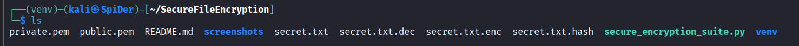
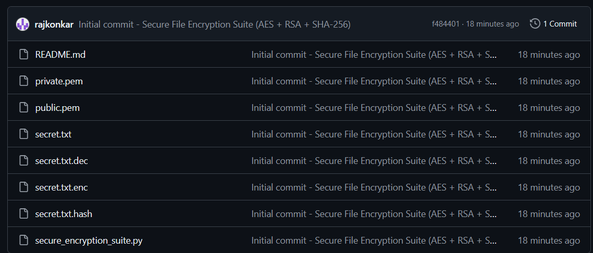
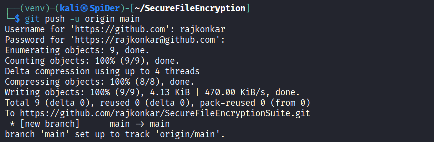

# Secure File Encryption Suite (AES + RSA + SHA-256)

## Overview
This tool encrypts and decrypts files securely using AES, RSA, and SHA-256 algorithms.
It ensures data confidentiality and integrity — similar to modern secure systems.

## Features
- AES file encryption/decryption
- RSA key-based encryption of AES key
- SHA-256 file integrity verification
- Simple CLI interface

## Setup Instructions
1. Create a virtual environment:
   python -m venv venv
   venv\Scripts\activate
2. Install dependencies:
   pip install pycryptodome
3. Run the tool:
   python secure_encryption_suite.py

## Example Run
Refer to screenshots for key generation, encryption, decryption, and hash verification.

## 📸 Project Execution Screenshots

| Step | Description | Preview |
|------|--------------|----------|
| 1 | Virtual Environment Setup & Library Installation |  |
| 2 | RSA Key Pair Generation |  |
| 3 | Encryption of File using AES + RSA |  |
| 4 | Decryption of Encrypted File |  |
| 5 | File Integrity Verification (SHA-256) |  |
| 6 | Git Push Confirmation |  |
| 7 | GitHub Repository Overview |  |

## Author
[Raj M Konkar]
Codec Technologies Internship Project
